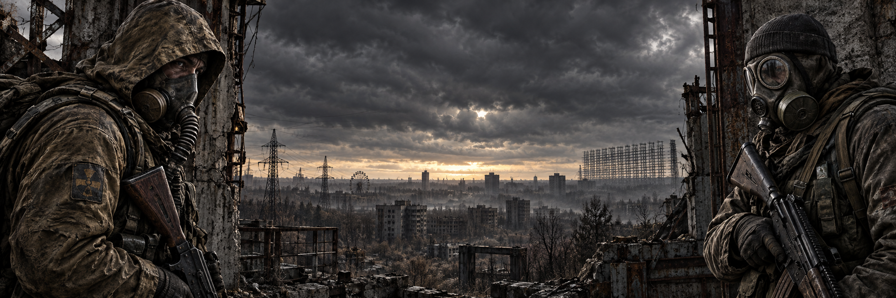

# Stalker Fan Club

A Ukrainian and English fan community portal inspired by the atmosphere of S.T.A.L.K.E.R. A portfolio project combining an illustrated interface with accounts, community publishing and a game-inspired inventory.

**[Open the live website](https://stalker-fan-club.yanickson69.chatgpt.site/)**

Український фан-портал: новини Зони, форум, чат, галерея та спорядження сталкера. Основна мова — українська; також доступна англійська.



## Features

- Responsive interface with a graphite and amber palette, textured panels and illustrated header and footer.
- News feed, forum discussions, comments and screenshot gallery.
- Registration, sign-in, profiles and selectable or uploaded avatars.
- Rich publishing editor with links, images, text colors, quotes, spoilers, preview and drafts.
- Sidebar community chat with periodic refresh.
- Activity rewards, equipment shop and inventory with a full-body character view.
- Ukrainian and English interface.

## Technology

| Layer | Implementation |
| --- | --- |
| Frontend | HTML, CSS and vanilla JavaScript |
| API | JavaScript on Cloudflare Workers |
| Database | Cloudflare D1, Drizzle schema and SQL migrations |
| Image storage | Cloudflare R2 |
| Build | Node.js file-based build script |
| Live hosting | Sites |

## Build

With a recent Node.js LTS release and npm installed:

```sh
git clone https://github.com/baronlda/stalker-site-v1.git
cd stalker-site-v1
npm ci
npm run build
```

The build produces `dist/client`, `dist/server` and deployment metadata in `dist/.openai`.

The complete application requires a Worker runtime with `DB` (D1), `BUCKET` (R2) and `ASSETS` bindings, plus the database migrations. The included `.openai/hosting.json` describes the existing Sites project. Deploying an independent copy requires your own hosting resources and configuration. A static preview or GitHub Pages alone does not run the account, forum, chat or inventory API.

## Project structure

```text
public/           Frontend, styles, fonts and artwork
server/index.mjs  Accounts and community API
db/               Database schema and migration generator
drizzle/          SQL migrations and schema snapshots
.openai/          Existing Sites hosting metadata
build.mjs         Build script
```

## Project status

This is a portfolio project under active development. Some starting content is demonstration content. Email verification and password recovery are not connected. The repository contains application code and migrations, not the live database, accounts, messages or user-uploaded files.

The interface, artwork and implementation were developed with AI assistance and iterative design direction.

## Artwork and credits

S.T.A.L.K.E.R. and associated game materials belong to GSC Game World. This is an unofficial fan project. Generated atmospheric artwork is used alongside game-inspired and third-party assets. Equipment image sources are recorded in [sources.json](public/assets/gear/sources.json). The title font is Amaz S.T.A.L.K.E.R. by Amazingmax. Third-party materials retain their respective rights; inclusion here does not grant a new license to them.

## Recovery archives

`stalker-site-v1.zip` and `stalker-site-v1.bundle` preserve the September 21, 2026 backup. The source files are now also available directly in the repository tree. The bundle preserves the earlier local Git history:

```sh
git clone stalker-site-v1.bundle stalker-site-backup
```
